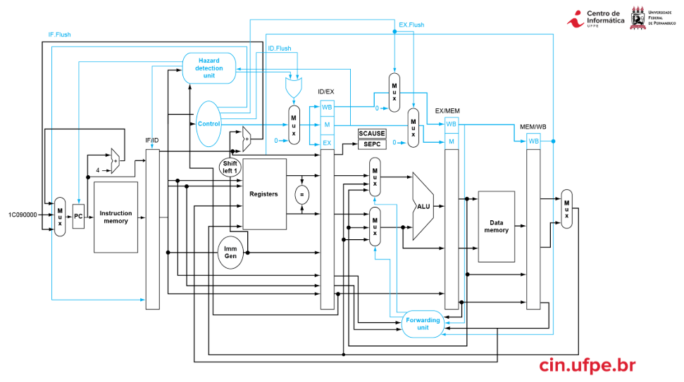

# Relatório — RV32I Pipeline

**Disciplina:** Laboratório de Organização e Arquitetura de Computadores (CIN0012)  
**Instituição:** Centro de Informática — UFPE  
**Professores:** Victor Medeiros e Edna Barros  
**Ano:** 2026

---

## Integrantes

| Nome | E-mail |
|------|--------|
| Caio Agrelli | caarr@cin.ufpe.br |
| Lucas David | ldlf@cin.ufpe.br |
| João Gustavo | jggp@cin.ufpe.br |
| Thales Afonso | tadg@cin.ufpe.br |

---

## Objetivo

Expandir um processador RISC-V RV32I com pipeline de 5 estágios, implementado em SystemVerilog, adicionando suporte a novas instruções ao longo de duas etapas. O projeto parte de um código-base fornecido e é verificado por simulação funcional no ModelSim.

---

## Arquitetura

O processador implementa um pipeline clássico de 5 estágios (IF → ID → EX → MEM → WB) com:

- **Forwarding** — elimina stalls de dados encaminhando resultados entre estágios
- **Hazard detection** — detecta load-use hazards e insere bolha no pipeline
- **Flush de branch** — descarta 2 instruções quando um desvio é tomado (resolução no estágio EX)
- **MMIO** — periféricos mapeados em memória (SW, KEY, LEDs, UART)

---

## Etapa 01 — Aritmética, Lógica e Deslocamentos

**Entrega:** 02/06/2026  
**Status:** Concluída ✅

### Instruções implementadas

| Formato | Instruções |
|---------|------------|
| R-type | `XOR`, `SLL`, `SRL`, `SRA`, `SLTU` |
| I-type | `ADDI`, `ANDI`, `ORI`, `SLTI`, `SLLI`, `SRLI`, `SRAI` |

### Arquivos modificados

| Arquivo | Modificação |
|---------|-------------|
| `pl_alu.sv` | Novos opcodes: XOR (4'd03), SLL (4'd06), SRL (4'd07), SRA (4'd08), SLTU (4'd12) |
| `pl_alu_ctrl.sv` | Decodificação R-type e I-type para os novos funct3/funct7 |
| `pl_control.sv` | Novo opcode I-TYPE (7'b0010011) com ALUOp=2'b11 |
| `pl_sign_ext.sv` | Extensão de sinal para imediatos I-type aritméticos |

### Divisão

| Integrante | Instruções |
|------------|-----------|
| Caio | XOR, ADDI, ANDI |
| Lucas | SLL, ORI, SLTI |
| João | SRL, SRA, SLLI |
| Thales | SLTU, SRLI, SRAI |

### Simulação

Resultado: **PASS** — ver [teste-etapa1.md](tests/teste-etapa1.md)

---

## Etapa 02 — Memória, Desvios e Saltos

**Entrega:** 09/06/2026  
**Status:** Concluída ✅

### Instruções implementadas

| Formato | Instruções |
|---------|------------|
| I-type (load) | `LB`, `LH`, `LBU`, `LHU` |
| S-type (store) | `SB`, `SH` |
| B-type | `BNE`, `BLT`, `BGE`, `BLTU`, `BGEU` |
| J-type | `JAL` |
| I-type (jump) | `JALR` |
| U-type | `LUI`, `AUIPC` |

### Arquivos modificados

| Arquivo | Modificação |
|---------|-------------|
| `pl_pipe_pkg.sv` | Novos campos: `jump`, `jalr`, `pc_plus4`, `alu_src_a[1:0]`, `result_src[1:0]` |
| `pl_sign_ext.sv` | Formatos J-type (JAL) e U-type (LUI, AUIPC) |
| `pl_control.sv` | Novos opcodes: JAL, JALR, LUI, AUIPC; novos sinais: Jump, Jalr, ALUSrcA, ResultSrc |
| `pl_datapath.sv` | Condição de branch generalizada (funct3), caminhos de PC para saltos, mux de WB com PC+4 |
| `pl_dmem.sv` | Escrita parcial (SB, SH) e leitura parcial com extensão de sinal (LB, LH, LBU, LHU) |

### Divisão

| Integrante | Responsabilidade |
|------------|-----------------|
| Thales | JAL, JALR, LUI, AUIPC + infraestrutura (pl_pipe_pkg, pl_sign_ext, pl_control, pl_datapath) |
| João | BNE, BLT, BGE, BLTU, BGEU (condição de branch generalizada) |
| Caio | LB, LH, LBU, LHU (leitura parcial na dmem) |
| Lucas | SB, SH (escrita parcial na dmem) |

---

## Referências

- Patterson, D. A.; Hennessy, J. L. *Computer Organization and Design RISC-V Edition*, 2ª edição.
- Especificação ISA RISC-V: [riscv.org](https://riscv.org/technical/specifications/)
