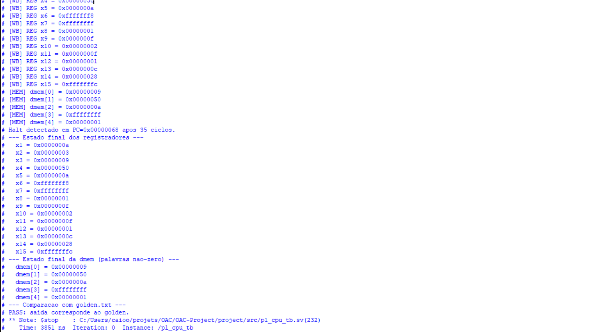

# Teste de Simulação — Etapa 01

**Data:** 2026-06-28
**Ferramenta:** ModelSim
**Status:** PASS

---

## Contexto

Verificação das 12 instruções implementadas na Etapa 01 via simulação funcional no ModelSim. O programa de teste foi montado com o assembler do projeto e executado no testbench `pl_cpu_tb.sv`, que compara a saída com um `golden.txt` de referência.

---

## Instruções Testadas

| Instrução | Tipo | Operação | Resultado esperado |
|-----------|------|----------|-------------------|
| `xor x3,x1,x2` | R | 10 XOR 3 | x3 = 9 |
| `sll x4,x1,x2` | R | 10 << 3 | x4 = 80 |
| `srl x5,x4,x2` | R | 80 >> 3 | x5 = 10 |
| `sra x7,x6,x2` | R | -8 >>> 3 | x7 = -1 |
| `sltu x8,x2,x1` | R | 3 <u 10 | x8 = 1 |
| `addi x9,x1,5` | I | 10 + 5 | x9 = 15 |
| `andi x10,x1,6` | I | 10 & 6 | x10 = 2 |
| `ori x11,x2,12` | I | 3 \| 12 | x11 = 15 |
| `slti x12,x6,0` | I | -8 < 0 | x12 = 1 |
| `slli x13,x2,2` | I | 3 << 2 | x13 = 12 |
| `srli x14,x4,1` | I | 80 >> 1 | x14 = 40 |
| `srai x15,x6,1` | I | -8 >>> 1 | x15 = -4 |

---

## Programa de Teste

Arquivo: `project/assembler/etapa01_test.asm`

```asm
addi x1,x0,10        # x1 = 10
addi x2,x0,3         # x2 = 3
xor  x3,x1,x2        # x3 = 9
sll  x4,x1,x2        # x4 = 80
srl  x5,x4,x2        # x5 = 10
addi x6,x0,-8        # x6 = -8
sra  x7,x6,x2        # x7 = -1
sltu x8,x2,x1        # x8 = 1
addi x9,x1,5         # x9 = 15
andi x10,x1,6        # x10 = 2
ori  x11,x2,12       # x11 = 15
slti x12,x6,0        # x12 = 1
slli x13,x2,2        # x13 = 12
srli x14,x4,1        # x14 = 40
srai x15,x6,1        # x15 = -4
addi x0,x0,0         # nop (x4)
sw   x3,0(x0)        # dmem[0] = 9
sw   x4,4(x0)        # dmem[1] = 80
sw   x5,8(x0)        # dmem[2] = 10
sw   x7,12(x0)       # dmem[3] = -1
sw   x8,16(x0)       # dmem[4] = 1
beq  x0,x0,0         # halt
```

---

## Resultado da Simulação



---

## Saída do Testbench

```
PASS: saida corresponde ao golden.
Halt detectado em PC=0x00000068 após 35 ciclos.
```

Estado final dos registradores e memória conforme esperado:

| Registrador | Valor |
|-------------|-------|
| x1 | 0x0000000A |
| x2 | 0x00000003 |
| x3 | 0x00000009 |
| x4 | 0x00000050 |
| x5 | 0x0000000A |
| x6 | 0xFFFFFFF8 |
| x7 | 0xFFFFFFFF |
| x8 | 0x00000001 |
| x9 | 0x0000000F |
| x10 | 0x00000002 |
| x11 | 0x0000000F |
| x12 | 0x00000001 |
| x13 | 0x0000000C |
| x14 | 0x00000028 |
| x15 | 0xFFFFFFFC |

| Endereço | Valor |
|----------|-------|
| dmem[0] | 0x00000009 |
| dmem[1] | 0x00000050 |
| dmem[2] | 0x0000000A |
| dmem[3] | 0xFFFFFFFF |
| dmem[4] | 0x00000001 |
