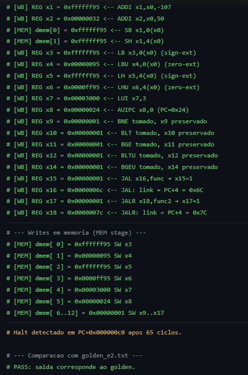

# Teste de Simulação — Etapa 02

**Data:** 2026-06-29
**Ferramenta:** ModelSim
**Status:** PASS

---

## Contexto

Verificação das instruções implementadas na Etapa 02 via simulação funcional no ModelSim. O programa de teste foi montado com o assembler do projeto (`hello_e2.asm`) e executado no testbench `pl_cpu_tb.sv`, que compara a saída com `golden_e2.txt` de referência. O script `run_e2.ps1` gerencia o swap dos arquivos hex e golden antes/depois da simulação.

---

## Instruções Testadas

| Instrução | Tipo | Operação | Resultado esperado |
|-----------|------|----------|-------------------|
| `sb x1,0(x0)` | S | mem[0].byte0 = x1[7:0] | dmem[0] = 0x95 |
| `sh x1,4(x0)` | S | mem[4].half0 = x1[15:0] | dmem[1] = 0xFF95 |
| `lb x3,0(x0)` | I (load) | sext(mem[0].byte0) | x3 = 0xFFFFFF95 |
| `lbu x4,0(x0)` | I (load) | zext(mem[0].byte0) | x4 = 0x00000095 |
| `lh x5,4(x0)` | I (load) | sext(mem[4].half0) | x5 = 0xFFFFFF95 |
| `lhu x6,4(x0)` | I (load) | zext(mem[4].half0) | x6 = 0x0000FF95 |
| `lui x7,3` | U | x7 = 3 << 12 | x7 = 0x00003000 |
| `auipc x8,0` | U | x8 = PC + 0 | x8 = 0x00000024 |
| `bne x1,x2,+8` | B | -107 ≠ 50 → desvia | x9 = 1 |
| `blt x1,x2,+8` | B | -107 < 50 → desvia | x10 = 1 |
| `bge x2,x1,+8` | B | 50 ≥ -107 → desvia | x11 = 1 |
| `bltu x2,x1,+8` | B | 50 <u -107 → desvia | x12 = 1 |
| `bgeu x1,x2,+8` | B | -107 ≥u 50 → não desvia | x14 = 1 |
| `jal x16,+8` | J | x16 = PC+4, salta +8 | x15 = 1 |
| `jalr x18,x16,20` | I (jump) | x18 = PC+4, salta x16+20 | x17 = 1 |

---

## Programa de Teste

Arquivo: `project/assembler/hello_e2.asm`

```asm
addi x1,x0,-107      # x1 = -107 (0xFFFFFF95)
addi x2,x0,50        # x2 = 50
sb x1,0(x0)          # mem[0].byte = 0x95
sh x1,4(x0)          # mem[4].half = 0xFF95
lb x3,0(x0)          # x3 = sext(0x95) = 0xFFFFFF95
lbu x4,0(x0)         # x4 = zext(0x95) = 0x00000095
lh x5,4(x0)          # x5 = sext(0xFF95) = 0xFFFFFF95
lhu x6,4(x0)         # x6 = zext(0xFF95) = 0x0000FF95
lui x7,3              # x7 = 0x00003000
auipc x8,0            # x8 = PC + 0
addi x9,x0,1
bne x1,x2,+8          # -107 != 50 → desvia (x9 = 1)
addi x9,x0,0
addi x10,x0,1
blt x1,x2,+8          # -107 < 50 → desvia (x10 = 1)
addi x10,x0,0
addi x11,x0,1
bge x2,x1,+8          # 50 >= -107 → desvia (x11 = 1)
addi x11,x0,0
addi x12,x0,1
bltu x2,x1,+8         # 50 <u -107 → desvia (x12 = 1)
addi x12,x0,0
addi x14,x0,1
bgeu x1,x2,+8         # -107 >=u 50 → não desvia (x14 = 1)
addi x14,x0,0
addi x15,x0,0
jal x16,+8            # x16 = PC+4, salta +8 → x15 = 1
addi x15,x0,0
addi x15,x0,1
addi x17,x0,0
jalr x18,x16,20       # x18 = PC+4, salta x16+20 → x17 = 1
addi x17,x0,0
addi x17,x0,1
sw x3,0(x0)           # dmem[0..12] = resultados
sw x4,4(x0)
sw x5,8(x0)
sw x6,12(x0)
sw x7,16(x0)
sw x8,20(x0)
sw x9,24(x0)
sw x10,28(x0)
sw x11,32(x0)
sw x12,36(x0)
sw x14,40(x0)
sw x15,44(x0)
sw x17,48(x0)
beq x0,x0,0           # halt
```

---

## Resultado da Simulação



---

## Saída do Testbench

```
PASS: saida corresponde ao golden.
```

Estado final dos registradores relevantes:

| Registrador | Valor | Descrição |
|-------------|-------|-----------|
| x1 | 0xFFFFFF95 | -107 |
| x2 | 0x00000032 | 50 |
| x3 | 0xFFFFFF95 | lb (sign-ext) |
| x4 | 0x00000095 | lbu (zero-ext) |
| x5 | 0xFFFFFF95 | lh (sign-ext) |
| x6 | 0x0000FF95 | lhu (zero-ext) |
| x7 | 0x00003000 | lui |
| x8 | 0x00000024 | auipc |
| x9 | 0x00000001 | bne tomado |
| x10 | 0x00000001 | blt tomado |
| x11 | 0x00000001 | bge tomado |
| x12 | 0x00000001 | bltu tomado |
| x14 | 0x00000001 | bgeu não tomado |
| x15 | 0x00000001 | jal (instrução pulada) |
| x16 | 0x0000006C | jal rd = PC+4 |
| x17 | 0x00000001 | jalr (instrução pulada) |
| x18 | 0x0000007C | jalr rd = PC+4 |

| Endereço | Valor | Conteúdo |
|----------|-------|---------|
| dmem[0] | 0xFFFFFF95 | lb result |
| dmem[1] | 0x00000095 | lbu result |
| dmem[2] | 0xFFFFFF95 | lh result |
| dmem[3] | 0x0000FF95 | lhu result |
| dmem[4] | 0x00003000 | lui result |
| dmem[5] | 0x00000024 | auipc result |
| dmem[6] | 0x00000001 | bne |
| dmem[7] | 0x00000001 | blt |
| dmem[8] | 0x00000001 | bge |
| dmem[9] | 0x00000001 | bltu |
| dmem[10] | 0x00000001 | bgeu |
| dmem[11] | 0x00000001 | jal |
| dmem[12] | 0x00000001 | jalr |
